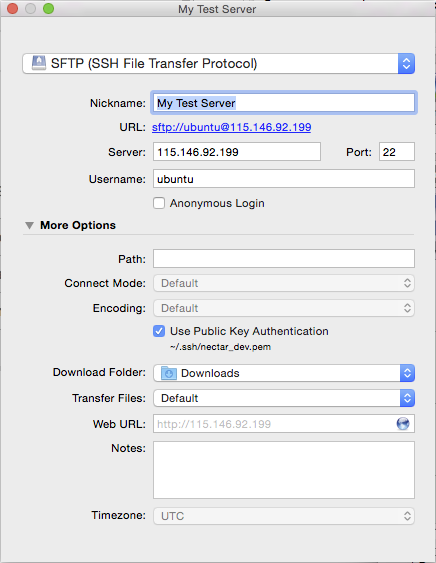

# Lesson IV: (30min)

-- *Slide* --

## Moving data to and from your new computer

-- *Slide End* --

> Whilst on the machine, Anna realises that she doesn't have a backup of the data that she has on her site. And thinks
> that it would be a good time to create one!

**Drawing**

Create a drawing showing the two computers: then during the following, refer to it!

e.g.:

    local   |   remote
      []    |     []

## scp

There is a command line program you can use called `scp` (**s**ecure **c**o**p**y) to move files to, or fetch files 
from, different machines. It is built on top of `ssh`.

Of course, on Windows its provided by Putty, and hence is called `pscp`

-- *Slide* --

### OSX

```bash
$ scp  -i <key>  USER_NAME@remote_machine_address:notes.txt notes.txt
```

### Windows

```bash
# You have to run "cmd.exe"
# then enter this command in the resultant console window
$ pscp  -i <pkey>  USER_NAME@remote_machine_address:notes.txt notes.txt
```

`scp` is shorthand for **s**ecure **c**o**p**y

`pscp` is **p**utty **s**ecure **c**o**p**y
-- *Slide End* --

As shown this command will copy the file named `notes.txt` from the home directory of the USER_NAME user on the remote
machine to a file named `notes.txt` in the local directory in which the command is being run:

Where of course `USER_NAME` is the default account on the remote machine, and `remote_machine_address` is either its
IP number or its domain name.

-- *Slide* --

### OSX

```bash
$ scp -i <key> notes.txt USER_NAME@remote_machine_address:notes.txt
```

### Windows

```bash
$ pscp -i <pkey> notes.txt   USER_NAME@remote_machine_address:notes.txt
```

-- *Slide End* --

This command will copy the file named notes.txt from the current directory of the local machine to a file
named notes.txt in the remote machine's USER_NAME home directory:

-- *Slide* --

### Question

```bash
$ scp  -i <key> USER_NAME@remote_machine_address:notes.txt notes.txt
```

Is the file: 

1. Being copied from the remote machine to the local machine
1. Being copied from the local machine to the remote machine

-- *Slide End* --

**Answer** from the remote machine to the local machine

-- *Slide* --

### Question

```bash
$ scp  -i <pkey>  notes.txt USER_NAME@remote_machine_address:notes.txt
```

Is the file: 

1. Being copied from the remote machine to the local machine
1. Being copied from the local machine to the remote machine

-- *Slide End* --

**Answer** from the local machine to the remote machine

-- *Slide* --

### Question

```bash
# From remote machine to local machine
$ scp -i <key> USER_NAME@remote_machine_address:notes.txt notes.txt

# From local machine to remote machine
$ scp -i <key> notes.txt USER_NAME@remote_machine_address:notes.txt
```

Is the source file 

1. Named on the left
1. Named on the right

-- *Slide End* --

**Answer**

Looking at the two commands you can see that the source for the transfer is on the left, and the target on the right.
So the answer is A. The original file is on the left, the target machine on the right.

**Demonstrate**

As you work through the following ask the audience what the command does and where the file is now...
Also ask questions, such as "how do I list files?"

```bash
echo "hello from afar"             # just echos the message back to us.
echo "hello from afar" > temp.txt  # directs the message to a file named temp.txt
more temp.txt
scp -i keys/key.pem temp.txt ubuntu@115.146.92.130:temp.txt
ssh -i keys/key.pem ubuntu@115.146.92.130
    ls
    more temp.txt
    pwd                             # to show that we are not on our local machine
    exit
pwd                                 # just to prove we are back on our local machine
ls
rm temp.txt                         # rm = remove!
ls                                  # file is gone!
scp -i keys/key.pem ubuntu@115.146.92.130:temp.txt newname.txt
more newname.txt
rm newname.txt
```

-- *Slide* --

### Windows Users

Can you find and run `cmd.ext`:

* <span style="color:white;background:red">R</span> = Help me!
* <span style="color:white;background:green">G</span> = All done

-- *Slide End* --

-- *Slide* --

### Exercise

I want everyone to create a file named, say, `whyme.txt` and then copy it onto their remote server.

For non existent bonus points, can you bring it back again with a different name?

* <span style="color:white;background:red">R</span> = Help me!
* <span style="color:white;background:green">G</span> = All done

-- *Slide End* --

Once the question is asked, show the following slide for people to copy.

-- *Slide* --

### If it helps!

```bash
echo "hello from afar" > temp.txt  # echo to a file named temp.txt
scp -i keys/key.pem temp.txt ubuntu@115.146.92.130:temp.txt
ssh -i keys/key.pem ubuntu@115.146.92.130
    more temp.txt
    pwd                             # we are not on our local machine
    exit
pwd                                 # we are back on our local machine
rm temp.txt                         # rm = remove!
```
-- *Slide End* --

### `scp` examples

**Demonstrate**

You don't have to type out the target file name. `scp` is very flexible!

From my machine to the remote instance:

```bash
$ scp  -i <path/to/key/keyfile> notes.txt USER_NAME@remote_machine_address:/some/remote/directory/
```

From the remote instance to the local directory

```bash
$ scp  -i <path/to/key/keyfile> USER_NAME@remote_machine_address:/some/remote/directory/notes.txt .
```

You can copy multiple files at once! Here the `~` means the home directory...

```bash
$ scp  -i <path/to/key/keyfile> notes1.txt notes2.txt  USER_NAME@remote_machine_address:~
```

You can use a wildcard denoted by the asterisk character (*) to copy multiple files in one go.

```bash
$ scp  -i <path/to/key/keyfile> *.txt  USER_NAME@remote_machine_address:~
```

As ever, `man` is your friend. But OSX users: be warned!

-- *Slide* --

### OSX: A gotcha!

```bash
scp -i keys/key.pem temp.txt ubuntu@115.146.92.130
```
### Does not work: it needs the colon!

e.g.:

```bash
scp -i keys/key.pem temp.txt ubuntu@115.146.92.130:
```

-- *Slide End* --

The colon is used by scp to indicate that this is a remote transfer. If you don't include it, the chances are
that you have a file named "ubuntu@115.146.92.130" on your local machine!

Just repeating the exercise

-- *Slide* --

### Exercise

I want everyone to create a file named, say, `simple.txt` and then copy it onto their remote server.

And bring it back again with a different name...

* <span style="color:white;background:red">R</span> = Help me!
* <span style="color:white;background:green">G</span> = All done

-- *Slide End* --

## CyberDuck

SCP is a good tool to have available. But a graphical environment can be much easier to use.

As part of the prerequisites, you were supposed to have installed [CyberDuck](https://cyberduck.io/).

Hold up a Green card if you've managed to do this.
And a Red card if you are going to be playing catchup!

## Connecting with CyberDuck

Now I'm going to show you how to connect with CyberDuck. But make notes, because you are going to be doing it next.


Right click and select "New Bookmark"


In the resultant dialogue select SFTP.
Provide a descriptive nickname for the bookmark.

For the Server provide the ip number of the machine read off of the dashboard.
Add 'ubuntu' as the Username.

Expand the 'More Options' drop down.



Select the "Use Public Authentication" checkbox, and in the resultant dialogue select the key file you used when you
launched the server. If in doubt, you can have a look at the server information tab on the dashboard.

Now close the dialogue. To connect to the server right click on the bookmark you've just created and select 
"Connect to Server". All going well, a ruled plain window should replace the pane showing the bookmarks. 

You should now be able to drag and drop files between the two machines!

-- *Slide* --

### Exercise

See if you can configure CyberDuck and then drag `whyme.txt` (the file you created earlier) back to your
local machine.

**NB** Windows users: use the original key you downloaded, and not your putty imported one!

### More imaginary bonus points

See if you can edit it in place on the remote machine!

* <span style="color:white;background:red">R</span> = Help me!
* <span style="color:white;background:green">G</span> = All done

-- *Slide End* --

In this lesson we've learnt two different ways of moving files between our remote server and our local machine.

This means that you know know how to make your data available to whatever "cloud app" you build, such as Anna's
Drupal website which is showcasing her kitten research.

Or, perhaps if you use RStudio to do data analysis on it, you can get it onto the that server.. 

In short, with your new found ability to move your data to and from your server in the cloud, 
you can now use multiple research apps with it!