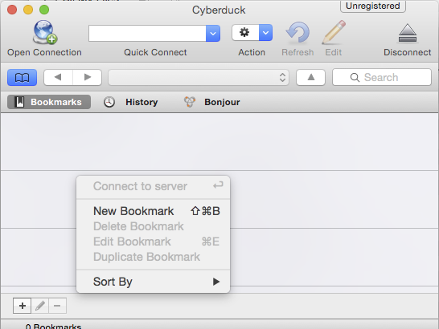

-- *Slide* --

# Lesson IV: Moving data to and from your new computer (30min)

-- *Slide End* --

> Whilst on the machine, Anna realises that she doesn't have a backup of the data that she has on her site. And thinks
> that it would be a good time to create one!

## scp

There is a command line program you can use called `scp` (**s**ecure **c**o**p**y) to move files to, or fetch files 
from, different machines. It is built on top of `ssh`.


-- *Slide* --

## Example 1

```bash
$ scp USER_NAME@remote_machine_address:notes.txt . 
```

`scp` is shorthand for **s**ecure **c**o**p**y

-- *Slide End* --

This `scp` command will copy the file named `notes.txt` from the home directory of the USER_NAME user on the remote 
machine to the local directory in which `scp` is being run:

Where of course `USER_NAME` is the default account on the remote machine, and `remote_machine_address` is either its
IP number or its domain name.

-- *Slide* --

## Example 2

```bash
$ scp notes.txt USER_NAME@remote_machine_address: 
```

-- *Slide End* --

This scp command will copy the file named notes.txt from the current directory of the local machine to the remote 
machine's USER_NAME home directory:

-- *Slide* --

## Question 1

```bash
# From remote machine to local machine
$ scp USER_NAME@remote_machine_address:notes.txt . 

# From local machine to remote machine
$ scp notes.txt USER_NAME@remote_machine_address: 
```

Is the **origin**al file 

1. Named on the left
1. Named on the right

-- *Slide End* --

**Answer**

Looking at the two commands you can see that the source for the transfer is on the left, and the target on the right.
So the answer is A. The original file is on the left, the target machine on the right.

You can use a wildcard denoted by the asterisk character (*) to copy multiple files in one go.

By way of example, I'm going to create a file locally, move it to the remote machine, then bring it back.

```bash
echo "hello from afar"             # just echos the message back to us.
echo "hello from afar" > temp.txt  # directs the message to a file named temp.txt
more temp.txt
scp -i key.pem temp.txt ubuntu@115.146.92.130 # Does not work: needs colons!
scp -i key.pem temp.txt ubuntu@115.146.92.130: 
ssh -i key.pem ubuntu@115.146.92.130
    ls
    more temp.txt
    pwd                             # to show that we are not on our local machine
    exit
pwd                                 # just to prove we are back on our local machine
ls
rm temp.txt                         # rm = remove!
ls                                  # file is gone!
scp -i key.pem ubuntu@115.146.92.130:temp.txt .
more temp.txt
rm temp.txt
```

-- *Slide* --

## Exercise 1

I want everyone to create a file named, say, `whyme.txt` and then copy it onto their remote server.

## Exercise 2

For non existent bonus points, bring it back again!

-- *Slide End* --

-- *Slide* --

# PS: if it helps...

```bash
echo "hello from afar"             # just echos the message back to us.
echo "hello from afar" > temp.txt  # directs the message to a file named temp.txt
more temp.txt
scp -i key.pem temp.txt ubuntu@115.146.92.130: 
ssh -i key.pem ubuntu@115.146.92.130
    ls
    more temp.txt
    pwd                             # to show that we are not on our local machine
    exit
pwd                                 # just to prove we are back on our local machine
ls
rm temp.txt                         # rm = remove!
ls                                  # file is gone!
scp -i key.pem ubuntu@115.146.92.130:temp.txt .
more temp.txt
rm temp.txt
```

-- *Slide End* --

Hold up a Green card when you've managed to do this.
And a Red card if you need help.

## CyberDuck

SCP is a good tool to have available. But a graphical environment can be much easier to use.

As part of the prerequisites, you were supposed to have installed [CyberDuck's home page](https://cyberduck.io/).

Hold up a Green card if you've managed to do this.
And a Red card if you are going to be playing catchup!

## Connecting with CyberDuck

Now I'm going to show you how to connect with CyberDuck. But make notes, because you are going to be doing it next.



Right click and select "New Bookmark"


In the resultant dialogue select SFTP.
Provide a descriptive nickname for the bookmark.

For the Server provide the ip number of the machine read off of the dashboard.
Add 'ubuntu' as the Username.

Expand the 'More Options' drop down.


Select the "Use Public Authentication" checkbox, and in the resultant dialogue select the key file you used when you
launched the server. If in doubt, you can have a look at the server information tab on the dashboard.

Now close the dialogue. To connect to the server right click on the bookmark you've just created and select 
"Connect to Server". All going well, a ruled plain window should replace the pane showing the bookmarks. 

You should now be able to drag and drop files between the two machines!

-- *Slide* --

## Exercise 3

See if you can configure CyberDuck and then drag `whyme.txt` (the file you created earlier) back to your
local machine. 

### More imaginary bonus points

See if you can edit it in place!

-- *Slide End* --

Hold up a Green card when you've managed to do this.
And a Red card if you need help.

In this lesson we've learnt two different ways of moving files between our remote server and our local machine.

This means that you know know how to make your data available to whatever "cloud app" you build, such as Anna's
Drupal website which is showcasing her kitten research.

Or, perhaps if you use RStudio to do data analysis on it, you can get it onto the that server.. 

In short, with your new found ability to move your data to and from your server in the cloud, 
you can now use multiple research apps with it!