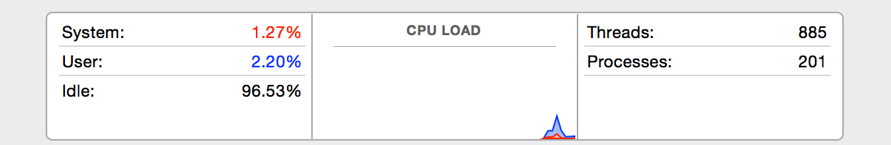

#The NeCTAR Cloud - 001

## Introduction

I used to be such a doubter. I thought the cloud was all just was just marketing hype. After all, who would let their
data and software be run by someone else, in data centers not under their direct control?

Mea Culpa. I was wrong. 

Like Paul on the road to Damascus, yes, I had an epiphany. I was wrong! 

I think that my story is an important enough story to share: because it shows just how disruptive the cloud actually is.

Gather around the campfire, and I'll tell the story of my personal trip to Damascus.

A few years ago the company I then worked for placed me as a consultant in the roll of technical team lead on a
project developing a new website for a University.

The team and I had a hard deadline of two months to deliver this new site: something that ordinarily would have taken
at least six months.

The first thing I did was calculate the number of servers that the team and I would need for the project. 

I picked up the phone to the university's IT services department.

"Could I have 5 servers to go please?" 

The voice on the other side cackled: "You're new here, aren't you? Go to our website, download the application form,
fill it in in triplicate, mail the copies to the acquisitions committee, who will then either approve or decline your
request. If approved, the request goes out to tender, the successful bidder is selected and an order placed.
Eventually you will get your servers."

"How long does this take" I asked, feeling faint. 

"The committee sits once a month, and they've just sat, so you'll have to wait a month, and then ordinarily it takes
at least 4 weeks for the hardware if the purchase is approved. So for you, at least 8 weeks"

I hung up and buried my head in my hands. We were totally screwed. There was no way that we could make our deadline! 

Then the University’s development lead said "I know a site that will host a defect reporting system for a few dollars
a month. Someone lend me a credit card".

Inspired by his example I thought "Amazon!" 

I phoned my company’s hardware and networking guru to talk it through. 

"Don't worry about Amazon - I've got a big server lying spare" he said. “I'll set up some virtual servers for your team
on it. How many do you want?”

30 minutes and $10 later we had all the hardware and software we needed and by the end of the day we were already
committing code and accepting defect reports.

In a blink of an eye the politics, processes and policies of the University had been totally upended. 

When physical servers eventually arrived their cost was in the order of about $20 000. And they arrived well before
the end of the project, because we threatened to go live on our virtual servers, thus demonstrating that the IT
services department wasn't really needed...

That project showed me that despite my doubts, cloud computing is a game changer. 

And importantly it’s a seductive game changer for researchers. 

Here’s a contrasting history. 

Two psychology researchers at an Australian university, who shall remain nameless, needed to do some fairly complex
statistical analysis. So out of their grant money they bought two powerful computers, at a cost of $10 000 per machine
to run [MatLab](http://au.mathworks.com/products/matlab/?nocookie=true) on. But on the first run, they found that the
machines couldn’t work with their data sets. The machines were underpowered! They were forced to iteratively upgrade
those machines, until finally, one was able to perform the required analysis.
It had taken them 12 months from the date of purchase to get to this point.

If, instead of purchasing hardware, they had turned to the cloud, they would have been able to have had their initial
machine running within minutes. If it was underpowered, they would have been able to upgrade it to a larger machine,
again within a matter of minutes. They probably wouldn’t even have had to re-install the software.

The really good news for researchers is that everyone with an AAF login can experience this game changer for themselves,
at no cost: through the National eResearch Collaboration Tools And Resources (NeCTAR) project.

If NeCTAR had been around when those two researchers were setting up their project that’s $20 000 of grant money that
could have been used elsewhere!

But before you go rushing to the NeCTAR cloud, there are some important gotchas that you have to understand. The
cloud environment is a not the same as dedicated computer! If you don’t take time to learn the pitfalls you will cause
yourself pain along the way. I hope to explain some of the gotcha’s to you in this talk, and then I’ll do a very high
level intro to the platform that NeCTAR uses, as it has some lessons of its own.

And if you find that you think you’ll be needing the cloud, I’ll leave you with some information about a course that
NeCTAR has created for researchers that should help you to navigate some of these shoals a little better.

## Virtualization

When I phoned our hardware guru, he gave us a single physical server to use. But he created several virtual servers
for us to use on it.

So what is a virtual server?

Ok. Lets start at the beginning of computing history. Those early computers would run one program at a time.
Sequentially. But then it was noticed that those computers were spending most of their time waiting. Waiting for
user input, for disk input. All kinds of events would leave them just waiting.

And those early computers were expensive - and often charged for by time. So the computer scientists of the day
thought: well, while one program is waiting for input, why don’t we run another? That way we’ll keep the expensive
machine busy.

Thus they came up with the idea of a scheduler that chose when to allow a program to run, and when to swap it with
another.

Now if you swap between programs fast enough, we humans, with our comparatively slow senses, we experience them as
though they were running in parallel.

(could write a sample demo application to go here)

So successful was this adventure in shared resources, it’s become thoroughly baked into modern computer architecture.

So that’s the first plank of the early foundations of virtualization: "parallel" execution of applications. The
technical term is “threading”. Multiple threads of execution.

Even today, such has the speed up of processors been, most of our computers are just sitting, waiting for input. 

(could show something like activity monitor - my computers load whilst I was working on this document:

)

Now a compiled program is simply a set of instructions for a computer. So couldn’t you write a program that pretended
to be a computer? A computer emulator in software in other words?

That would give you all kinds of advantages: you could run programs that were designed for one computer, on another one.
You could keep old programs that are intended for old computers that are no longer made, running: on more modern
computers. You could run a program that’s designed for one operating system, on another - by simply launching its
target operating system in such a computer emulator.

Those early computer scientists set to work, and soon delivered working emulators. Those initial emulators ran really
slowly.

But with time they worked out how to make them more efficient. As they did so, these emulators became increasingly
useful. So much so that like threading, this concept is baked into the computers of today.

And that’s the second plank of virtualization: computer emulation.

Thanks to threading, you can run multiple emulators on a physical machine at the same time. 

So threading and emulation: That’s "virtualization" in the shallowest of nutshells.

Now if you have a grunty server spending most if it’s time not doing much, you can provide multiple virtual servers
for people to use. That’s exactly what what my hardware guru did for us when I was at that university way back when.

This virtualization is a very common model for cloud providers to use in sharing computing resources.
A single physical server hosts many virtual machines, each of which is running their own private operating system.

Virtualization is a thing of wonder to me.

For example, you can install Linux into a virtual machine run by VirtualBox, an open source software emulator,
on your OS X computer, and then once that Linux machine is running, install a different virtual machine engine into it,
into which you can then run, say Microsoft Windows…

(Perhaps a demo?)

The whole thing reeks of Russian Dolls, and boggles my brain.

If you think about it, having all those virtual machines sharing one physical cpu means that your application
running on one of those virtual machines may well be impacted by what's happening in the other virtual machines –
especially with regard to input and output. Because you are all sharing the same narrow pipes to the world beyond.

I love the term used to describe this effect: "Noisy neighbours".

So, if your application is running on a virtual machine whose host that has another virtual machine running an
application that makes heavy use of the network, your application will possibly struggle to make use of the network.

Or if your application is running on a virtual machine whose host is scheduling another virtual machine in preference
to yours, you might struggle to do anything!

Another feature of virtualization that boggles my brain is the ability to migrate a running virtual machine from one
physical machine to another.

You simply have to stop that virtual machine, then make a copy of its hard disk and memory, then send it as a set of
files to another machine where it can all be started up again.

The wonder! This live migration allows the cloud providers to optimise the utilisation of their physical servers.
Of course, while this is happening, your virtual machine isn’t going to be available.

And of course, if you can make a copy of a running machine, you save it as a backup - and restart it at some later
point in time.

## History

One of the earliest companies to realize that they could make money by selling virtual servers to others was, of
course Amazon. They simply realized that they [could make money out of any excess capacity](http://blog.b3k.us/2009/01/25/ec2-origins.html)
that they had.  And they had a fair amount of excess capacity, depending on the time of the year. Also, they would buy
hardware in anticipation of future use, and then it would sit idle until such time as they enough demand to use it.
So they had a strong economic incentive to charge others for this idle hardware!

Being the pioneers, they largely established the early cloud market.

In those days servers were generally big highly reliable performant machines. And they were expensive! 

But another company, Google, being somewhat cash strapped in its early days, had taken a slightly different tack to
the rest of the industry. Realizing that if you have a lot of computers running the same software, you don’t actually
need expensive reliable machines, as you can just switch off the ones that don’t work. So they built their own servers
out of ordinary cheap commodity hardware. [And stacked them together using sheets of cardboard! ](http://commons.wikimedia.org/wiki/File:Google%E2%80%99s_First_Production_Server.jpg)

This use of commodity hardware meant that their costs were way below that of their competitors. And so this concept
became a very important driver for the market as a whole.

Thus the chances are that any software that you are running out in most of the clouds out there will in fact be
running on plain old commodity hardware. (This is not necessarily true of NeCTAR - check)

So. The cloud sounded promising at the start of this talk. Instant access and cheap start up costs. But sharing
potentially unreliable hardware with noisy neighbours? That doesn’t sound ideal, does it?

But look at what you are getting in return: The capability to launch more machines almost instantly if need be.
Being able to switch to a more powerful machine without having to go through a purchase cycle . The ability to move
from one running machine to another. And being able to make quick backups of the entire state of your machine.
And what’s more, you don’t have to find physical space to put those servers into: or to upgrade, maintain, and
keep them nicely air conditioned.

Look at where Google’s underpowered servers took them. Can anyone name Google’s original search competitors?  

## Buzzword Bingo

Cloud computing comes in so many different flavours and models that it can be quite confusing.

To me cloud computing is simply the use of computing resources (both hardware and software) that are delivered as a
service over the internet.

And there are three important ways of delivery that have arisen:

* **SaaS:** Software As A Service
     Synonym: Application – End Users
* **PaaS:** Platform As A Service
     Synonym: API – Developers
* **IaaS:** Infrastructure As A Service
      Synonym: Hardware – System Administrators

Software as a service means that you are interacting with a cloud based application, ordinarily by means of a
web browser. However, the trend is, especially in the mobile space, toward native clients. Examples of SaaS? GMail,
Dropbox and SalesForce.

Platform as a service means that you are creating an application around an API or library that abstracts the underlying
cloud infrastructure away. Examples of PaaS? Google's AppEngine, AppScale, Heroku and Engine Yard.

Infrastructure as a service: providers offer computers and storage as resources. You provision these machines with
operating systems and software yourself. The most famous of these providers is of course, Amazon.

IaaS is the cloud computing plane that the Nectar cloud lies in.

##Game: Guess that \*aaS

We have too many "aaS"'s in this industry. Any guesses as to the following:

* **DRaaS:**    Disaster Recovery as a Service
* **DBaaS:**    Database as a service
* **CaaS:**     Compute as a Service
* **BaaS:**     Backend as a Service You write the client, we provide the server side stuff
                Could also be "Backup as a Service", so yes, we’ve overloaded the terms!
* **EaaS:**     Everything as a Service
                Yes! Really. WTF?
* **STaaS:**    STorage as a Service
                "You bring it, we store it" [Kennards](http://www.kss.com.au/)
* **XaaS:**     "X" as a Service. Yes, an algorithm for tired IT professionals.
* **ITaaS:**    IT as a service. You can replace your tired IT professionals.
* **ZaaS:**     Zombies as a Service… I made this up, only to find that it’s actually in use.

## Storage

Now lets try and mentally walk through what happens when you ask for a machine to be fired up for you on the NeCTAR
cloud.

Somewhere there has to be a hard drive for your machine that you are going to start. After all, it might be virtual,
but it still has to boot from a hard drive.

But remember that because we are emulating the computer, we can make its "disk" a file on the host computer's hard
drive. The software running in the virtual machine has no idea that it is reading and writing to a rather large file:
it just sees it as a hard drive.

So we need to get a copy of a machine’s hard drive onto a file, and then move that file onto the host computer’s drive.

That copy of a machines hard drive is termed an "image". And NeCTAR have a library of pre-built images that you can use.
The NeCTAR images are just bare Linux operating systems. You will still have to install your own software on top of that
to get them to work for you.

However, you can make your own images and add them to the image library. Obviously, the library of images must live in
some kind of data store.

When you launch a virtual machine, you choose an image to use. That image is copied from the data store across to the
physical drive on the physical server that is going to be used to run your virtual machine, and then is used to boot
your virtual machine.

Because you need somewhere to keep your data, a separate file is also created on the host computer and presented to
that virtual machine as a second hard drive.

So here’s a question. You have a virtual machine running. It makes all kinds of changes to its hard drives. Which are
simply files on the host server. What happens to those changes when you shut your virtual computer down?

Lets look at some of the options. The cloud provider can simply delete the files. Or they can copy them back to the
image catalogue, as new images. This would require extra storage, of an unknown size, network bandwidth, and software
to manage it all. And after that you might not even need that image. So the first option is the most prevalent.
The image is simply wiped.

So your virtual machine has what is termed an "ephemeral" drives. Anything written to these drives will be lost if
it’s associated virtual machine is terminated.

Rebooting or restarting its associated virtual machine does not cause the ephemeral data to vanish. But if you switch
it off, then, whatever you wrote to this ephemeral storage will be lost the minute your virtual machine is terminated.
All upgrades, security patches, whatever data you wrote, all will be lost.

I've seen ephemeral storage take so many people by surprise when they first start using the NeCTAR cloud.

In order to give you a place to save your data beyond the runs of your virtual machine, you either need to use what is
termed a persistent volume, or the object store.

Persistent volumes are independent of any given virtual machine instance. 

When first created they are effectively blank. have no partition, and no file system. They must be explicitly
attached to an instance, and then have a file system created on them. partitioned and formatted. Then they can be used
as though they were an external hard drive. Think of persistent volumes as network attached storage.

The object store is an attempt to create a simpler and more reliable abstraction to store data in than a file system.
It has the advantage of supporting redundant sharable copies of data via a simple interface. It has the disadvantage
that it can be a lot slower than a regular file system, and that it has to be accessed via an interface, rather than
being addressed like a file system. Which means that applications have to have code created specially to support it.

## Security

Lets play another game. Lets ponder how bad people could get their hands on the valuable data that runs on your server.

They have several paths available to them: by physical access, by network access, or by simply getting it from someone
who has access to the data.

Physical access: they sneak in, steal the computer. Or put some kind of monitoring software onto it. Is this attack
vector possible with a cloud provider? I would argue that breaching security in a big data center is harder than it is
in your local office. And even if they got through the front doors, how would they know which of the vast number of
servers to target?

So I believe in terms of physical access, the cloud is more secure.

Getting the data from someone who has access to it: well, if it’s trusted colleague, there’s not much that you can do
about it. Whether it’s on the cloud or not.

Could be though, that they do get access a staff member from the cloud provider. Who could give the bad people a copy
of your hard drive file.

So you need to encrypt the hard drive of your virtual machine if you have valuable data on it. But you would be doing
that if you had a local physical server as well, wouldn’t you?

Which leaves the network.

How many people in this room have used free public wifi to access their, say, email?

You are aware that a lot of public wifi is very easily listened to? To protect yourself you should make sure that you
are using a VPN to access confidential stuff: An encrypted channel over the network link, in other words.

Similarly, when connecting to your machines on the cloud you should ensure that you are using an encrypted network
connection.

There are other network things that you should be doing both on and off the cloud, but we won’t go into them now.

Instead I’m going to ask another question: do you trust the software that you are running on your computers right now?

How do you know that one of the programs isn’t secretly reading and sending your data out to the world? How do you know
that one of the programs hasn’t got a defect in it that will allow hackers to compromise both it and then your computer?

So when you install software onto a machine, you have to be able to trust it, somehow. And you have to know that it is
being maintained, with fixes being released. And you have to be prepared to update the software if it has any security
holes.

Of course, if you’re not updating your software when the creator adds new features, you run the risk of running a
version that is no longer supported by them, thus making your job of upgrading more difficult. So you should have some
sort of strategy for managing the updates for software that you use.

And be aware that the more software that you install on to your computer, the greater your risk of being exposed by
these problems.

And again, this is something that you should be doing, not just to computers running on the cloud, but for all of the
computers under your control.

So I would argue that when it comes to security, there is a lot that we should be doing both on and off the cloud:
that some things are easier to do on the cloud, others off it, but that there is a lot of overlap.

However, there is one place that you are absolutely vulnerable in the cloud. Your virtual computer is running in the
memory of a physical computer: and in that space it is totally vulnerable to giving away its secrets.

It has been demonstrated that it is possible for a VM to read the data of the VM that preceded it in memory. So you
are reliant on cloud provider to wipe the memory between VM runs. But this memory loophole is one that you can’t defend
against. It’s not in your cloud providers interests to allow people to attack you in this way, but governments have a
way of mandating backdoors into systems.

So the advice to take on board here is that if you have data that foreign governments might find valuable, don’t put
your data into data centers run by their companies. And bear in mind that some governments do:
see [industrial espionage as an acceptable practice](http://www.reuters.com/article/2014/01/26/us-security-snowden-germany-idUSBREA0P0DE20140126).

At this point I’d like to remind everyone that NeCTAR is Australian, in Australia.

## OpenStack

The NeCTAR cloud is built using an open source project named OpenStack.

At it's heart OpenStack is really just a lot of Python scripts that glue together a raft of other, more mature,
projects to create an open source IaaS cloud computing implementation that makes heavy use of virtualization.

And like most software, it has a mess of moving parts, and a history that explains how those parts came to be what they
are.

How did it come into being?

Over a candlelit dinner, just over four years ago, NASA and RackSpace looked deeply into each others eyes, and decided
to combine two different system, an object storage component from RackSpace, and a virtual machine manager from NASA
named Nebula, and to release them to the world under an Apache 2 licence an open source licence that allows anyone to
use it.

To me RackSpace's storage component was mature and in production use, NASA's cloud component was young, and not in such
widespread use. Luckily for this match, they were both written in the same programming language, Python.

As a point of interest, one of the reasons that NASA wrote Nebula was that they felt that Amazon was targeted at web
hosting, and they needed to work with very large "science scale" data sets. So Nebula scales – it was used with NASA's
large research data sets.

Once the project was created the community grew as other companies joined it. One of the first outside companies to
become involved was Canonical, the makers of Ubuntu.

When Canonical signed up it appears that they threw both developers, infrastructure and resources into the project. 

As a result, Ubuntu, Canonical's Launchpad provides the project management, and the two projects release cycles are
synchronised.

So OpenStack thus has a six monthly release cycle, each release cycle being kicked of with a design month that includes
a summit meeting held somewhere suitably exotic. The design month is followed by an implementation phase, then
everything is locked down for the usual release candidate dance.

NeCTAR try to deploy these releases as soon as they can after they have formally been released.

As an aside, Red Hat, even though late to the party, have thrown a lot of resources into OpenStack. So in a very short
time they have become a major player as well.

The names of the releases are somewhat bewildering:

Austin, Bexar, Cactus, Diablo, Essex, Folsom, Grizzly, Havana, Icehouse, Juno and Kilo, currently under development.

That's because these names are selected by choosing "cool sounding" city or county names that are near to the site of
the design summit meeting as candidate names, and then having a poll to select the winning name.

Initially, OpenStack planned to be compatible with Amazon.  support Amazon's API's. But as time progressed I believe
that it came to view this compatibility layer these API's as a strategic weapon armed in Amazon's favour – and so no
longer spends a great deal of time and effort in trying to be 100% compatible with Amazon.

Since those early days other companies have become involved. Big ones, like AT&T, IBM, Hewlett Packard, Dell, Cisco....
Why, even Microsoft has contributed code.

In its short lifetime, OpenStack has grown to be, IMHO, a rather large and exciting project. 

There are over 180 companies involved, and over 400 developers beavering away on the code in one form or other.
In order to support this growth RackSpace ceded control to a foundation that now steers the project.

So Be Prepared: History teaches us:

* OpenStack is young, some parts are reasonably new, and the internal interfaces and naming conventions between its
  components aren't that consistent yet.
* If you write code that directly directly works with either Amazon or OpenStack, you are potentially locking yourself
  into a pan galactic strategic battle. Use a library to abstract those pesky differences between the two away,
  if you can.
* That there are a lot of companies out there who are contributing and adding new features to the code base.
* That NeCTAR will be upgrading and adding those new features every six months or so!

OpenStack is not a single piece of software: it is a collection of modular components, each one targeting a particular
aspect of of the whole.

As such it is based on a set of separate development projects. The code developed by each project targets a specific
role within OpenStack. In typical fashion, each project has their own project name.

Dashboard is the web front end that gives people a nice GUI to interact with the system. Dashboard's OpenStack project
name is "Horizon".

Compute manages the startup, provision and shutdown of the virtual machines within the system. Compute's project name
is "Nova".

The Object Storage is a fault tolerant redundant file store. Its project name is "Swift".

The Image Store is a catalogue/repository for disk images. Its project name is "Glance".

Block Storage simply provides persistent storage for the running virtual machines. In essence it's simply providing
persistent blank hard drives to the applications on the virtual machines to use as they will. Its code name is "Cinder"

There is also a database as a service project, named Trove. This service is currently in beta release at NeCTAR.
I’m a developer, and this is a seriously attractive project. You don’t have to worry about installing databases,
about managing and maintaining them, and backing them up.

Underpinning all of this is an identity service, named "Keystone"

To me, based on the amount of swearing I heard at NeCTAR, the effort involved in getting an OpenStack deployment setup
s spent in the configuration of all these components to work together.

BTW, because of this modular design you can use a number of these components in their own right.

In Amazonian

To map this all to Amazon's services:
* Compute/Nova is similar to EC2
* Object Storage/Swift is similar to S3
* Image/Glance plays the roll of the AMI catalogue
* Block Storage/Cinder is similar to EBS

Each of these projects has a place in the NeCTAR web dashboard that you see when you sign in. Of course that dashboard
is simply a slightly customized version of the OpenStack one.

But each of these projects also have their own API’s that are accessible to applications and scripts. And each of
these projects also ship with command line clients that are more fully featured and powerful than the dashboard
components.

So to make effective use of the NeCTAR cloud you should learn how to install and use these command line tools. A trick
made more difficult by the fact that the dashboard has been rewired to support AAF logins. However access and using
the correct credentials is easy.

## Beware the Hype!

We’ve covered quite a few concepts: (possibly ask for audience to describe each one)

Virtualization (might want to point out somewhere that this can affect monitoring software)

Noisy Neighbours

Live migrations

Commodity hardware

Ephemeral storage

Block storage

Object storage.

The software that makes up the NeCTAR cloud, and its wrinkles.

Given all the points we've just discussed you can see that moving existing applications to the NeCTAR cloud does
require a certain amount of investment and understanding.

As a software developer, this is a personal pain point. If you hear people say "Oh, we'll just put out onto the cloud"
be prepared to start to argue with them. These are hype-tevated people, and they need a cold dose of reality poured
into their world.

(At this point perhaps do a calculation showing that your application is going to more unreliable in the cloud?)

You can't just take an existing application and shove out to the cloud and expect it to be as performant and reliable
as it was on highly specced dedicated hardware.

But you can expect to get resources almost immediately, and for them to scale almost infinitely, and for a far smaller
risk than buying and deploying physical hardware.

To do this effectively you need to understand the application that you are planning to put on the cloud. You need to
understand the cloud environment that you are putting the application into. You need to be able to work out what
tradeoffs you are making along the way.

In short you need a NeCTAR Driver’s Licence!

