# Walk through of a YAML template

## Template sections

A Heat template is divided into several sections. These are the sections that
will typically appear in a Heat template:

* `heat_template_version` - A field that allows you to specify which version
   of Heat the template was written for (optional)
* `description` - A field that allows you to describe the intent of the template
  to a human audience (optional).
* `parameters` - The specification of any arguments that the user might be
  required to provide (optional).
* `resources` - The specification of the OpenStack resources that are to be
  created (mandatory).
* `outputs` - Any expected values that are to be returned once the template
  has been processed (optional).
  
The following table contains a guided tour of a 
[template](https://raw.githubusercontent.com/NeCTAR-RC/heat-templates/master/juno/Ubuntu/apache_single_instance_aws.yaml)
in the [NeCTAR sample template repository](https://github.com/NeCTAR-RC/heat-templates)
that install the Apache web server on a single Ubuntu instance.

| Meaning                            | Template content                      |
|------------------------------------|---------------------------------------|
| The first line of a YAML template  | 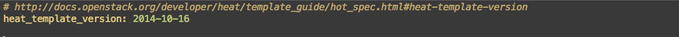|
| should list a version indicator.   |                                       |
| If present Heat will parse the file |                                      |
| appropriately. If not present then |                                       |
| Heat will assume that the file     |                                       |
| adheres to the most recent         |                                       |
| specification.                     |                                       |
|------------------------------------|---------------------------------------|
| An optional section that allows    | 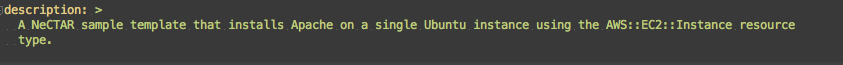|
| you to provide a description of the |                                      |
| template.                          |                                       |
|------------------------------------|---------------------------------------|
| An optional section that allows    | 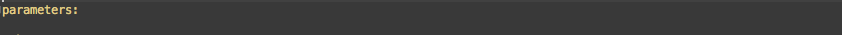  |
| you to specify any input parameters |                                      |
| that might be required when the    |                                       |
| configuration described in the     |                                       |
| template is built.                 |                                       |
|------------------------------------|---------------------------------------|
| Each parameter is in its own nested | 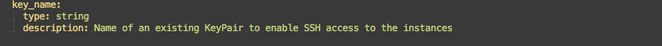     |
| block, with the name appearing in  |                                       |
| the first line, and attributes as  |                                       |
| further nested elements            |                                       |
|------------------------------------|---------------------------------------|
| * `type` is a mandatory element    | 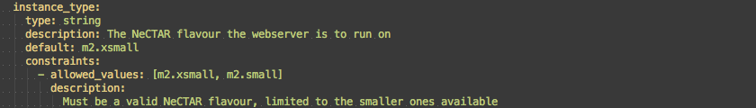|
|    for a parameter that can be one of: |                                   |
|    `string`, `number`, `json` or   |                                       |
|    `comma_delimited_list`          |                                       |
| * `description` is an optional     |                                       |
|    attribute that provided         |                                       |
|    guidance to people using the    |                                       |
|    template                        |                                       |
|------------------------------------|---------------------------------------|
| * `default` is an optional         | 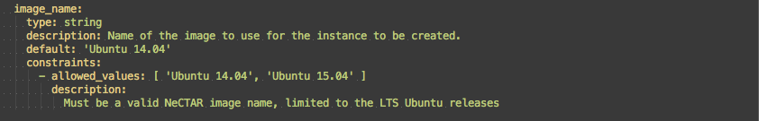  |
|   attribute that provides a default |                                      |
|   value for the parameter.         |                                       |
| * Constraints on the user entered  |                                       |
|   value can also be set.           |                                       |
|------------------------------------|---------------------------------------|
| A mandatory section that defines   | 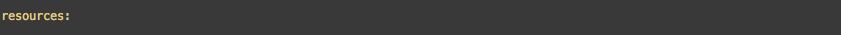    |
| the resources that the application |                                       |
| will need.                         |                                       |
|------------------------------------|---------------------------------------|
| Each resource is in its own nested | 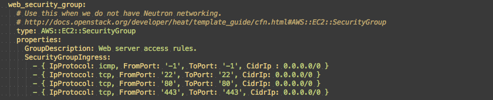|
| block, with the name appearing in  |                                       |
| the first line, and attributes as  |                                       |
| further nested elements            |                                       |
|                                    |                                       |
| Type defines the OpenStack         |                                       |
| resource type to be built. The     |                                       |
| complete list supported can be     |                                       |
| found in the                       |                                       |
| [template guide](http://docs.openstack.org/developer/heat/template_guide/)||
|                                    |                                       |
| Each resource has its own attribute |                                      |
| set. These are documented in the   |                                       |
| template guide - e.g.: the         |                                       |
| [AWS::EC2::SecurityGroup](http://docs.openstack.org/developer/heat/template_guide/cfn.html#AWS::EC2::SecurityGroup)||   
|------------------------------------|---------------------------------------|
| This resource type builds an       | 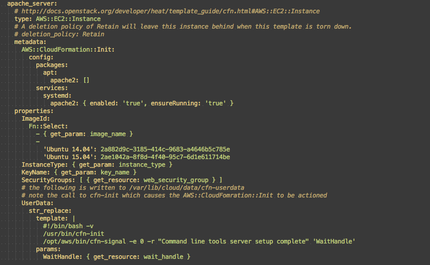|
| instance with apache installed.    |                                       |
|                                    |                                       |
| For this to work the image must    |                                       |
| have a package named `cloudinit`   |                                       |
| installed. The `AWS::CloudFormation::Init` section  |                      |
| provides instructions as to what   |                                       |
| should be done on the instance.    |                                       |
|                                    |                                       |
| `Fn::Select` is a function that will |                                     |
| select an item from a list.        |                                       |
|                                    |                                       |
| `get_param` is a function that returns |                                   |
| the value of the named parameter   |                                       |
| that was set by the user.          |                                       |
|                                    |                                       |
| The Heat manual contains a complete |                                      |
| list of [built in functions](http://docs.openstack.org/developer/heat/template_guide/hot_spec.html)||
| Currently NeCTAR supports the Juno release|                                       |
|                                    |                                       |
| UserData is a mechanism by which   |                                       |
| information can be passed to an    |                                       |
| instance at launch time. The       |                                       |
| Typically this will be either a    |                                       |
| a shell script or a configuration  |                                       |
| file.                              |                                       |
|                                    |                                       |
| Note that the chosen image for the |                                       |
| instance must support `cloudinit`  |                                       |
| for this to work.                  |                                       |
|------------------------------------|---------------------------------------|
| These resource types will          | 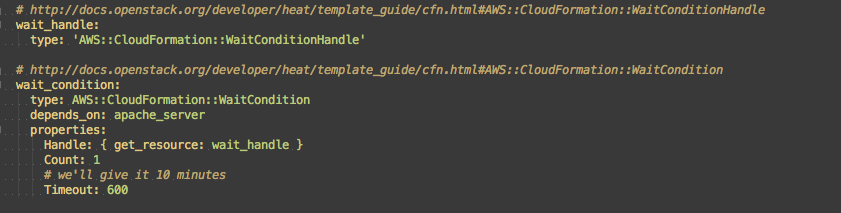|
| notify the heat engine when the    |                                       |
| software is fully installed on the |                                       |
| instance.                          |                                       |
|------------------------------------|---------------------------------------|
| The outputs will show once the     | 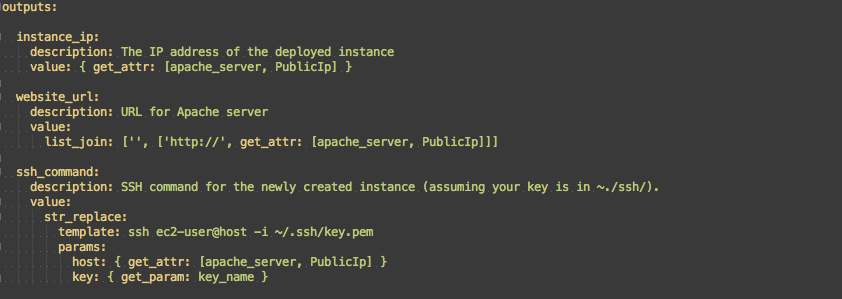|
| heat engine has finished building  |                                       |
| the template.                      |                                       |
|------------------------------------|---------------------------------------|